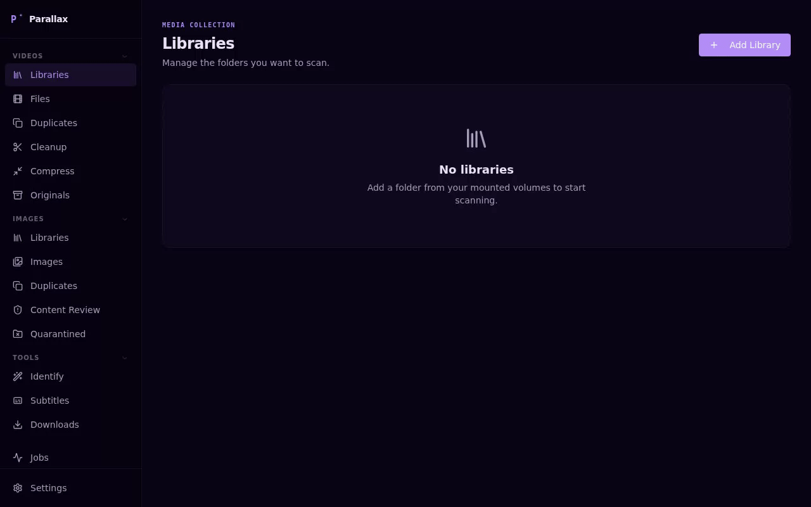

# Parallax

A self-hosted media library manager with hardware-accelerated compression, duplicate detection, subtitle management, and media identification. Runs in Docker, accessible from any browser.



## Features

### Videos
- **Library management** — scan video folders; browse by status, resolution, bitrate, duration; split into sub-libraries; libraries auto-rescan when files change on disk
- **Compression** — re-encode to H.264, HEVC, or AV1 via the dedicated Compress page; hardware-accelerated with NVIDIA NVENC and Intel/AMD VA-API, automatically spreading work across every detected GPU when more than one is present; CRF slider with live estimated savings; smart-select by codec (e.g. "non-HEVC"); cancelable bulk job with per-file progress; originals preserved in `_originals/`
- **Toolbox** — bulk file-repair utilities in collapsible tool sections: trim start/end (stream-copy when a keyframe is near the cut point, falls back to hardware-accelerated re-encode otherwise, also multi-GPU aware), audio channel isolation (left/right → stereo), rotate, normalize volume, faststart (move moov atom for web playback), and A/V sync offset; cancelable bulk job with per-file progress; originals preserved in `_originals/`
- **Duplicate detection** — 10 stackable criteria: size, duration, resolution, content date, orientation, bitrate, filename (fuzzy match), byte-hash, perceptual hash (configurable similarity threshold, first-frame/all-frames mode, frames-per-video 4–64), and audio fingerprint; matching runs entirely client-side and recomputes instantly as you toggle criteria — no server round-trip. One background job, "Extract," fills in byte-hash/pHash/audio-fingerprint data for whichever files need it
- **Cleanup** — filter and bulk-delete by duration, resolution, FPS, content date, file-added date, file size, orientation, filename (exact or fuzzy), or content detections; all filters stack with invert/exclude support
- **Identify & Rename** — turn a folder of badly-named files into a clean Plex/Jellyfin library in one full-width workspace:
  - **TMDB matching** for TV shows and movies — search, then place files into episode slots by drag *or* click-to-pick (each episode row shows its TMDB still); all seasons load at once, an ✕ pulls a file back out
  - **Custom Show mode** — no TMDB entry needed: point at a folder of YouTube downloads (a playlist, a channel, an abridged series) and it becomes a one-season show. Order episodes by filename, embedded upload date, date added, drag-and-drop, or by typing an episode number to slot a file in place; titles auto-cleaned from filenames
  - **Metadata & artwork** — writes Kodi/Jellyfin/Plex `.nfo` sidecars (show + per-episode) and generates a poster and backdrop from a frame of the first episode, show title set in Inter, colour keyed to the frame — all offline, no scraping
  - Optional **move to** a destination folder as part of the rename (works across filesystems); preview every rename, `.nfo`, and image before applying
- **Subtitles** — scan a folder for missing subtitle files; bulk-download best matches or open a Plex-style search dialog; powered by subf2m.co (no account, no daily limit, multi-language); multiple subtitle tracks shown in the Plyr player with a language picker

### Images
- **Library management** — scan image folders with automatic thumbnail generation; browse and filter your collection; libraries auto-rescan when files change on disk
- **Duplicate detection** — find duplicate images by perceptual hash with configurable similarity threshold
- **Content review** — filter by content detections, file size, orientation, dates, or "no detections at all"; bulk quarantine flagged images; restore or permanently delete from quarantine

### AI
- **Content detection** — flag inappropriate content with configurable confidence thresholds; review, quarantine, or bulk-delete flagged files; runs CPU-only, in an isolated subprocess, batch size tunable per your hardware

### Downloads
- **yt-dlp integration** — paste one or more URLs and queue downloads with live progress; supports YouTube, Vimeo, Twitch, and thousands of other sites
- **Quality & codec control** — choose resolution (Best/4K/1080p/720p/480p/360p) and codec preference (Auto/H.264/H.265/AV1/VP9); quality-first fallback so codec degrades gracefully before resolution does
- **Audio mode** — extract audio-only in mp3/m4a/opus
- **Browser impersonation** — one-click enable with a dropdown of available targets from the installed binary; requires curl-cffi (included in the `yt-dlp_linux` standalone binary)
- **Cookies** — paste Netscape-format cookies for session-only auth (age-restricted and logged-in content); ephemeral, never written to disk
- **Trimming** — download a clip by setting start/end timestamps
- **Subtitles** — optionally download subtitle files alongside the video
- **yt-dlp management** — install/update from Settings → Downloads; stable or nightly channel; binary lives in the data volume and persists across rebuilds; quick Update button on the Downloads page shows current version
- **Download history** — persists across restarts; clear from list (file kept) or delete with file (shift-click skips confirm)
- **Playback** — completed downloads play in the built-in Plyr player with subtitle support

### General
- **Job queue** — background jobs with live progress, phase labels, logs, and cancellation
- **Library delete safety** — when deleting a library that has `_originals/` or `_quarantine/` leftovers, prompts to delete them, review them, or keep them on disk
- **Eight themes** in two groups — Parallax set: Parallax (default), Graphite, Nightfall, Rose Quartz, OLED · Colour set: Deep Space, Modern HUD, Neon Grid — selectable in Settings → General
- **Grid size control** — every card grid (Files, Cleanup, Compress, Toolbox, Images) has a slider for card size, persisted globally across all pages

---

## Windows

Parallax runs on Windows via [Docker Desktop](https://www.docker.com/products/docker-desktop/). There is no separate installer — Docker handles the runtime environment.

**All users:** Install [Docker Desktop for Windows](https://www.docker.com/products/docker-desktop/) and make sure it is running before continuing. WSL 2 backend is required (the default).

**NVIDIA GPU users:** A recent Game Ready or Studio driver (521+) is all you need — NVENC/NVDEC hardware transcode support for Docker is included in the driver automatically via WSL 2. No separate CUDA toolkit or NVIDIA Container Toolkit install is required on Windows. Pass `--gpus all` (or the Compose `deploy.resources` block) as shown below.

**AMD GPU users:** VA-API device passthrough (`/dev/dri`) is not available under WSL 2 / Docker Desktop on Windows, so hardware-accelerated transcoding isn't available on this path — the same image still runs fine CPU-only.

Once Docker Desktop is running, follow the [Docker Compose](#docker-compose-recommended) instructions below, adding the GPU block for your hardware if applicable. Everything else — the compose file, volume mounts, port — is identical to Linux.

---

## Deployment

Pre-built images are published to the GitHub Container Registry on every release. There is a single image — it runs CPU-only out of the box and picks up hardware transcode automatically when you pass a GPU through (see the Compose/Run examples below):

| Tag | Notes |
|-----|-------|
| `ghcr.io/raslan/parallax:latest` | Latest release |
| `ghcr.io/raslan/parallax:1.2.0` | Exact version |
| `ghcr.io/raslan/parallax:1.2` | Latest patch on the 1.2 minor line |

Pin to a specific release by replacing `latest` with a version tag, e.g. `1.2` to track all patch releases on 1.2.

### Nightly builds (unstable)

Every push to the `develop` branch rebuilds and overwrites one fixed tag — no version bump, no changelog entry, and the release tags above (`latest`, versioned) are never touched:

| Tag | Notes |
|-----|-------|
| `ghcr.io/raslan/parallax:nightly` | Whatever most recently landed on `develop` |

**This is unstable by design.** It tracks whatever most recently landed on `develop` — possibly mid-feature, untested against real hardware, or outright broken. Use it only to try unreleased work ahead of a release, never for a media library you care about; keep backups. Each push overwrites the tag in place, so there's no way to pin to "yesterday's nightly" — if it breaks something, the fix is to wait for the next push or fall back to a release tag.

Substitute `nightly` for the release tag in any Compose/Run example below to try it, e.g. `ghcr.io/raslan/parallax:nightly` in place of `ghcr.io/raslan/parallax:latest`.

---

### Docker Compose (recommended)

Save this as `docker-compose.yml`, create a `data/` folder alongside it, then run `docker compose up -d`. One image for every setup — add the GPU block for your hardware, or leave it out entirely to run CPU-only.

**CPU only:**
```yaml
services:
  parallax:
    image: ghcr.io/raslan/parallax:latest
    container_name: parallax
    ports:
      - "7899:7899"
    volumes:
      - ./data:/app/data       # database, thumbnails, keyframes, model cache
      - /mnt/media:/media      # your media — add as many mounts as needed
    environment:
      - DATA_DIR=/app/data
      - HF_HOME=/app/data/hf-cache
    user: "1000:1000"          # match your host UID:GID — run `id` to check
    restart: unless-stopped
```

**NVIDIA:** add this `deploy` block to the service above (same image, same everything else):
```yaml
    deploy:
      resources:
        reservations:
          devices:
            - driver: nvidia
              count: all
              capabilities: [gpu, video]
```

`count: all` forwards every NVIDIA GPU on the host into the container — with more than one, Compress and Toolbox jobs automatically spread transcode work across all of them, no extra configuration needed.

**AMD (VA-API):** add these to the service above instead:
```yaml
    devices:
      - /dev/dri:/dev/dri
    group_add:
      - video
```

---

### Docker Run

One image for every setup — add `--gpus all` or `--device /dev/dri:/dev/dri` for your hardware, or leave both out to run CPU-only.

**CPU only:**
```bash
docker run -d \
  --name parallax \
  -p 7899:7899 \
  -v ./data:/app/data \
  -v /mnt/media:/media \
  -e DATA_DIR=/app/data \
  -e HF_HOME=/app/data/hf-cache \
  --user 1000:1000 \
  --restart unless-stopped \
  ghcr.io/raslan/parallax:latest
```

**NVIDIA:** add `--gpus all`:
```bash
docker run -d \
  --name parallax \
  -p 7899:7899 \
  -v ./data:/app/data \
  -v /mnt/media:/media \
  -e DATA_DIR=/app/data \
  -e HF_HOME=/app/data/hf-cache \
  --user 1000:1000 \
  --gpus all \
  --restart unless-stopped \
  ghcr.io/raslan/parallax:latest
```

`--gpus all` forwards every NVIDIA GPU on the host — same multi-GPU auto-distribution as the Compose example above.

**AMD (VA-API):** add `--device /dev/dri:/dev/dri --group-add video`:
```bash
docker run -d \
  --name parallax \
  -p 7899:7899 \
  -v ./data:/app/data \
  -v /mnt/media:/media \
  -e DATA_DIR=/app/data \
  -e HF_HOME=/app/data/hf-cache \
  --user 1000:1000 \
  --device /dev/dri:/dev/dri \
  --group-add video \
  --restart unless-stopped \
  ghcr.io/raslan/parallax:latest
```

---

## Configuration

### Volumes

| Mount | Purpose |
|-------|---------|
| `/app/data` | Database, thumbnails, keyframes, downloaded AI models |
| `/media` (or any path) | Your media folders — mount as many as needed |

### Port

Default is `7899`. Override with the `PORT` environment variable:

```yaml
environment:
  - PORT=8080
ports:
  - "8080:8080"
```

### User

Set `--user UID:GID` (or `user:` in Compose) to match your host user so files created by the container are owned correctly. Find your UID/GID with `id`.

### NVIDIA prerequisites (Linux only)

Requires the NVIDIA driver and container toolkit installed on the host before running a CUDA build.

#### for Debian / Ubuntu

1. **Install kernel headers and build tools** — required for the driver's DKMS module to compile against your running kernel.

2. **Install the latest NVIDIA driver** — distro repos often lag; follow [NVIDIA's driver installation guide for Debian/Ubuntu](https://docs.nvidia.com/datacenter/tesla/driver-installation-guide/debian.html) to get a current version. RTX 50xx (Blackwell) requires driver ≥ 570.

3. **Reboot** — the driver won't be active until the system restarts. Verify with `nvidia-smi` after rebooting.

4. **Install NVIDIA Container Toolkit** — follow the official guide at [docs.nvidia.com/datacenter/cloud-native/container-toolkit/install-guide.html](https://docs.nvidia.com/datacenter/cloud-native/container-toolkit/install-guide.html). This is what allows Docker to pass the GPU into containers.

5. **Configure the Docker runtime** — run `nvidia-ctk runtime configure --runtime=docker` then `systemctl restart docker`. This adds the NVIDIA runtime to `/etc/docker/daemon.json`.

---

## First run

1. Open [http://localhost:7899](http://localhost:7899)
2. Go to **Settings → AI Models** to download the content detection model (required for AI content scanning on images)
3. Go to **Settings → Keys & Accounts** and add a free [TMDB API key](https://www.themoviedb.org/settings/api) to enable TMDB matching in Identify — its Custom Show mode and subtitle downloads via subf2m.co need no account or API key
4. To use the Downloads feature, go to **Settings → Downloads** and click **Install yt-dlp** — choose stable or nightly channel first
5. Add a library — **Videos → Add Library** for a video folder, **Images → Add Library** for an image folder
6. Run a scan; for image libraries it generates thumbnails and runs the AI pipeline; on the Duplicates page, run "Extract" once to fill in byte-hash/pHash/audio fingerprint data, then toggle criteria — matching recomputes instantly in the browser

---

## Build from source

If you want to build your own image (e.g. to run unreleased code):

```bash
git clone https://github.com/raslan/parallax.git
cd parallax

# CPU
docker build -t parallax:cpu .

# NVIDIA CUDA
docker build --build-arg RUNTIME=cuda -t parallax:cuda .

# AMD ROCm
docker build --build-arg RUNTIME=rocm -t parallax:rocm .
```

Then substitute `parallax:cuda` (etc.) for the `ghcr.io/...` image in the examples above.

> When iterating locally, always pass `--build` to `docker compose up` — a plain restart won't pick up code changes.

---

## Stack

- **Backend** — Python 3.12, FastAPI, SQLAlchemy, SQLite, ffmpeg, babelfish, guessit
- **Frontend** — React, TypeScript, Vite, shadcn/ui, Tailwind CSS
- **Container** — multi-stage Docker build (Node → Python), single port, three runtime targets
